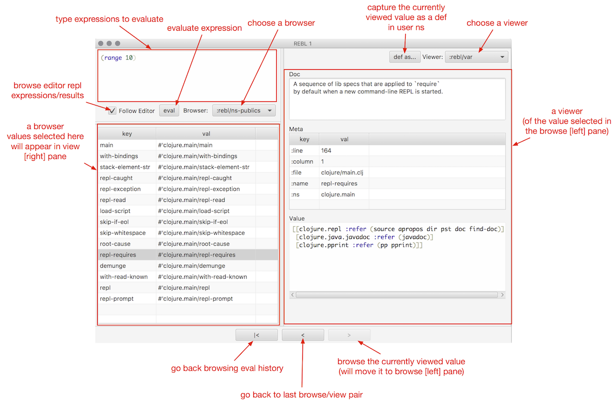

# `REBL`

REBL is a graphical, interactive tool for browsing Clojure data. REBL is extracted from Datomic tools developed by the [Datomic Team](https://www.datomic.com/) at [Cognitect](https://cognitect.com), and is available for non-commercial use (per EULA on downloads page) free of charge. We hope that many Clojure developers will find it useful. 

## Features

* A two-pane browser/viewer system for viewing collections and their contents
* Navigation into and back out of nested collections
* A structured editor pane for entering expressions to be evaluated
* A root browse of a history of expression evaluations
* The ability to 'wrap' a stdio based REPL (e.g. Clojure's native REPL) so that it can monitor and display the interactions therein, while still allowing them to flow back to the host (e.g. the editor)
* When used with non-stdio repls (e.g. nREPL), can be launched a la carte and accepts values to inspect via an API call
* The ability to capture nested values as defs in the user namespace
* The ability to run multiple independent UI windows
* Metadata viewing
* Datafy support
* Extensibility to new browsers and viewers
* Full keyboard control via [hotkeys](https://github.com/cognitect-labs/REBL-distro/wiki/Hotkeys)



REBL runs in your application JVM process, and can be used at dev-time without adding any runtime deps. The UI is written in JavaFX.

## Release Status

REBL is early access. Your feedback can help make it better. Please report any [issues](https://github.com/cognitect-labs/REBL-distro/issues) that you encounter.

## Usage:

REBL is part of the Cognitect dev-tools. [Get the latest version of
Cognitect dev-tools](https://cognitect.com/dev-tools/index.html) and unzip
it. From the unzip directory, install the dev-tools with the
`install` script:

    bash ./install

Add an alias to your `~/.clojure/deps.edn` (to enable for all
projects) or to an individual project's `deps.edn`:

``` clj
{:aliases
 {:rebl        ;; for JDK 11+
  {:extra-deps {com.cognitect/rebl          {:mvn/version "${REBL-VERSION}"}
                org.openjfx/javafx-fxml     {:mvn/version "15-ea+6"}
                org.openjfx/javafx-controls {:mvn/version "15-ea+6"}
                org.openjfx/javafx-swing    {:mvn/version "15-ea+6"}
                org.openjfx/javafx-base     {:mvn/version "15-ea+6"}
                org.openjfx/javafx-web      {:mvn/version "15-ea+6"}}
   :main-opts ["-m" "cognitect.rebl"]}
  :rebl-jdk8   ;; for JDK 8
  {:extra-deps {com.cognitect/rebl {:mvn/version "${REBL-VERSION}"}}
   :main-opts ["-m" "cognitect.rebl"]}}}
```

Replace your normal repl invocation (`clj`, or `clojure` e.g. for
inferior-lisp) with the appropriate alias for your JDK version:

    # for JDK 11+
    clj -A:rebl

    # for JDK 8
    clj -A:rebl-jdk8`

Your repl should start, along with the REBL UI. Everything you type in the repl will also appear in REBL. You can also type expressions right into REBL's editor (in the upper left). REBL will maintain a history of exprs+results in the root browse table.

You can start more UIs with `(cognitect.rebl/ui)`

## Limitations

REBL currently requires Java 1.8 or [Java 11](https://github.com/cognitect-labs/REBL-distro/wiki/Java-11-Usage)
